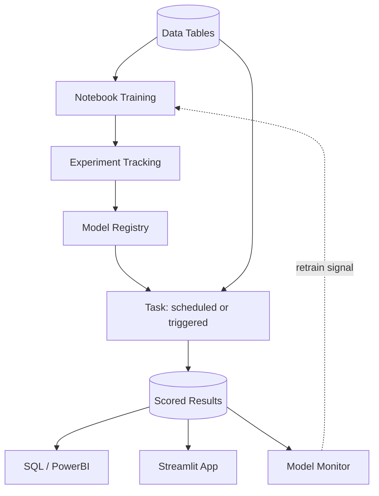

# Machine Learning on Snowflake: One Platform, End to End

Most ML teams stitch together a database, a compute environment, an experiment tracker, a model store, a scheduler, and a monitoring vendor. This guide shows the same lifecycle running entirely inside Snowflake — same Python, same libraries, without the plumbing between them.

> **Just want to train and register a model?** Jump to [Notebooks](#1-snowflake-notebooks--python-native-training) and [Model Registry](#3-model-registry--governed-versioned-callable). The rest fills in around it.

**Audience:** Data scientists and ML engineers moving workloads onto Snowflake

**Companion code:**

| File | Purpose |
|---|---|
| [`credit_default_model.ipynb`](credit_default_model.ipynb) | Training, evaluation, experiment tracking, model registration |
| [`demo_inference_and_tasks.sql`](demo_inference_and_tasks.sql) | SQL inference, approve/decline logic, scheduled scoring task |
| [`model_monitoring_setup.sql`](model_monitoring_setup.sql) | Monitor setup and every metric query, verified end to end |
| [`streamlit_app.py`](streamlit_app.py) | Credit decisioning UI — single applicant and batch scoring |
| [`optional_sample_data.sql`](optional_sample_data.sql) | Synthetic stand-in table, so the notebook runs before your own data is available |

The notebook reads a table named `LOAN_APPLICATIONS` in `CREDIT_RISK.ML`. Point it at your own table and update the `feature_cols` list to match your columns — or run `optional_sample_data.sql` first to create a stand-in and try the flow end to end.

> **Reference only — no support provided.** Validate against the linked documentation before production use. Snowflake ML features move quickly; a few noted below are in preview and may change.

---

## Start Here: What Are You Trying to Do?

| If you want to... | Go to |
|---|---|
| Train a model on Snowflake compute instead of a VM | [1. Notebooks](#1-snowflake-notebooks--python-native-training) |
| Compare many experiments without losing track of them | [2. Experiment Tracking](#2-experiment-tracking--compare-and-reproduce) |
| Version models and stop managing conda environments | [3. Model Registry](#3-model-registry--governed-versioned-callable) |
| Ship preprocessing along with the model | [4. Preprocessing Pipelines](#4-preprocessing-pipelines-in-the-registry) |
| Let analysts and BI tools call the model | [5. SQL Inference](#5-sql-inference--anyone-can-call-the-model) |
| **Schedule an existing multi-step Python script** | [6. Tasks & Orchestration](#6-scheduled-tasks--python-orchestration) |
| Handle upstream data that arrives late | [7. Data Dependencies](#7-handling-upstream-data-dependencies) |
| Track drift and performance without a monitoring vendor | [8. Model Monitoring](#8-model-monitoring--built-in-metrics) |
| Give non-technical stakeholders a UI | [9. Streamlit](#9-streamlit--end-user-applications) |
| Connect Snowflake to your Git repo | [10. GitHub](#10-connecting-snowflake-to-github) |

Sections run in workflow order, so reading top to bottom also works.

---

## Why Snowflake for ML?

| Traditional (On-Prem VMs) | Snowflake |
|---------------------------|-----------|
| Fixed compute — limited hyperparameter tuning | Resize the warehouse per workload; scaling takes effect on the next query |
| Data exports from SQL Server to Python environments | Data and training in one platform — no movement |
| Feature logic duplicated between training and scoring scripts | Register preprocessing with the model so both paths use one definition |
| Pickle files on shared drives, no versioning | Model Registry with versioning, lineage, and access controls |
| YAML files and conda envs for dependency management | Each model version is fully isolated with its own dependencies |
| Manual monthly/weekly scoring | Scheduled and event-triggered Tasks run automatically |
| No drift detection or monitoring | Native Model Monitor with built-in PSI, AUC, precision, recall |
| Pay for VMs 24/7 whether idle or not | Pay-per-second — idle costs nothing |

---

## Architecture Overview



Everything in that diagram is a Snowflake object governed by the same RBAC — no external services, no data egress.

---


## 1. Snowflake Notebooks — Python-Native Training

Train models using the same Python libraries you use today (XGBoost, scikit-learn, LightGBM, PyTorch) — running on elastic Snowflake compute instead of fixed VMs.

```python
from snowflake.snowpark.context import get_active_session
from xgboost import XGBClassifier

session = get_active_session()
df = session.table("MY_DATA").to_pandas()  # One line - no export

model = XGBClassifier(n_estimators=200, max_depth=5)
model.fit(X_train, y_train)
```

**Sizing compute:**

Start on the smallest warehouse that works and size up only when you hit a real limit — a job that runs too long, or one that spills to disk. Resizing takes effect on the next query, so there's no penalty for guessing low first.

```sql
-- Size up for a tuning sweep, back down when it's finished
ALTER WAREHOUSE COMPUTE_WH SET WAREHOUSE_SIZE = 'LARGE';
-- ... run experiments ...
ALTER WAREHOUSE COMPUTE_WH SET WAREHOUSE_SIZE = 'X-SMALL';
```

Each size step doubles both the compute and the cost per second. A job that finishes twice as fast on the next size up costs about the same — so scaling up is often free in practice, and only wasteful when the workload can't use the extra capacity.

- **Warehouses** cover most ML work: data prep, training, batch scoring
- **Compute Pools** for GPU workloads (deep learning, distributed training)
- **Pay-per-second** with auto-suspend, so an idle warehouse costs nothing

---

## 2. Experiment Tracking — Compare and Reproduce

Record every training run's parameters, metrics, and artifacts. Compare runs side-by-side. No MLflow server to install or maintain.

```python
from snowflake.ml.experiment import ExperimentTracking

exp = ExperimentTracking(session=session, database_name="CREDIT_RISK", schema_name="ML")
exp.set_experiment("CREDIT_DEFAULT_EXPERIMENT")

with exp.start_run("xgboost_v1"):
    exp.log_params({'max_depth': 5, 'learning_rate': 0.1, 'n_estimators': 200})
    exp.log_metrics({'auc': 0.76, 'ks_statistic': 0.41, 'gini': 0.52})
```

**What you get:**

- Full parameter and metric history for every run
- Side-by-side comparison in Snowsight
- Audit trail: who ran what, when, with what results
- A direct path from "best experiment" to Model Registry

Autologging callbacks are available for XGBoost, LightGBM, and Keras — metrics are captured per training iteration with no manual logging.

---

## 3. Model Registry — Governed, Versioned, Callable

Register trained models as first-class Snowflake objects. Each version is isolated with its own dependencies.

```python
from snowflake.ml.registry import Registry

reg = Registry(session=session, database_name="CREDIT_RISK", schema_name="ML")

mv = reg.log_model(
    model,
    model_name="CREDIT_DEFAULT_MODEL",
    version_name="v1",
    sample_input_data=X_test.head(10),
    conda_dependencies=["xgboost", "scikit-learn"],
    target_platforms=["WAREHOUSE"],
    comment="XGBoost credit default model. AUC=0.76, KS=0.41",
)
```

**What the Registry provides:**

| Capability | Benefit |
|-----------|---------|
| Versioning | v1, v2, v3 all callable simultaneously — roll back by re-pointing an alias |
| Dependency isolation | Each version records its own package versions. One model on xgboost 1.7 and another on 2.0 coexist without conflict — no conda environments to activate, no YAML files to keep in sync |
| Input/output schema | Consumers know exactly what to pass and what they get back |
| Lineage | Which table and columns trained this version |
| Explainability | SHAP values enabled automatically when logged with `sample_input_data` and a warehouse target |
| Access control | Standard Snowflake RBAC |

Pass a **Snowpark** DataFrame (not pandas) as `sample_input_data` to capture data lineage.

---

## 4. Preprocessing Pipelines in the Registry

You can register a preprocessing pipeline together with the model so one call does both transformation and scoring.

### Option A: sklearn Pipeline (recommended)

The registry natively supports `sklearn.pipeline.Pipeline`, including pipelines that end in an XGBoost model.

```python
from sklearn.pipeline import Pipeline
from sklearn.preprocessing import StandardScaler
from sklearn.impute import SimpleImputer
from xgboost import XGBClassifier

pipe = Pipeline([
    ('imputer', SimpleImputer(strategy='mean')),
    ('scaler', StandardScaler()),
    ('classifier', XGBClassifier(n_estimators=200, max_depth=5)),
])
pipe.fit(X_train, y_train)

mv = reg.log_model(
    pipe,
    model_name="CREDIT_DEFAULT_PIPELINE",
    version_name="v1",
    sample_input_data=X_test.head(10),
    conda_dependencies=["scikit-learn", "xgboost"],
    target_platforms=["WAREHOUSE"],
)
```

Raw input goes in, a score comes out — the transformation is baked in:

```sql
SELECT CREDIT_RISK.ML.CREDIT_DEFAULT_PIPELINE!PREDICT_PROBA(<raw columns>)
FROM NEW_APPLICATIONS;
```

### Option B: CustomModel for anything more complex

If your preprocessing isn't expressible as an sklearn Pipeline, or you need to chain several models:

```python
from snowflake.ml.model import custom_model
import pandas as pd

mc = custom_model.ModelContext(
    feature_preproc=my_preprocessor,   # sklearn pipeline object
    model=my_xgb_model,                # any natively supported model type
)

class CreditScoringModel(custom_model.CustomModel):
    def __init__(self, context: custom_model.ModelContext) -> None:
        super().__init__(context)

    @custom_model.inference_api
    def predict(self, input: pd.DataFrame) -> pd.DataFrame:
        features = self.context['feature_preproc'].transform(input)
        probs = self.context['model'].predict_proba(features)
        return pd.DataFrame({'prob_default': probs[:, 1]})

mv = reg.log_model(
    CreditScoringModel(mc),
    model_name="CREDIT_DEFAULT_CUSTOM",
    version_name="v1",
    sample_input_data=X_test.head(10),
    conda_dependencies=["scikit-learn", "xgboost"],
)
```

Supported model objects passed into the context are serialized automatically — no manual pickling.

Two things to get right:

- Always access model objects through `self.context[...]` inside the class rather than assigning them to `self` in `__init__`. Direct assignment captures a second copy in a closure and significantly inflates the serialized model.
- Inference methods must handle **multi-row DataFrames**. Server-side batching can combine single-record requests from different callers into one DataFrame.

To bring helper modules along, use `code_paths=["src/preprocessing_utils"]`.

### Which to use

Use the **sklearn Pipeline** whenever your preprocessing fits it — it's the simpler path and needs no custom class. Reach for **CustomModel** when you need to chain several models, call a library the registry doesn't support natively, or return multiple output columns.

Either way, packaging preprocessing with the model means the transformation that ran at training time is the same one that runs at scoring time. That's the main reason to do it rather than keeping a separate cleaning script.

**Docs:** [Pre-processing and post-processing with models](https://docs.snowflake.com/en/developer-guide/snowflake-ml/model-registry/custom-processing-with-models)

---

## 5. SQL Inference — Anyone Can Call the Model

Once registered, the model is callable from SQL. No Python required for consumers.

```sql
WITH scored AS (
    SELECT
        APPLICANT_ID,
        CREDIT_RISK.ML.CREDIT_DEFAULT_MODEL!PREDICT_PROBA(
            FICO_SCORE, VANTAGE_SCORE, NUM_OPEN_TRADES, ...
        ):output_feature_1::FLOAT AS PROB_DEFAULT
    FROM NEW_APPLICATIONS
)
SELECT
    APPLICANT_ID,
    ROUND(PROB_DEFAULT, 3) AS PROB_DEFAULT,
    CASE WHEN PROB_DEFAULT > 0.35 THEN 'DECLINE' ELSE 'APPROVE' END AS DECISION
FROM scored;
```

`PREDICT_PROBA` returns class probabilities; `PREDICT` returns the hard class label. For risk scoring you almost always want `PREDICT_PROBA` — `output_feature_1` is the probability of the positive class.

**Who can call it:**

- Credit analysts via Snowsight
- BI teams via PowerBI or Tableau — the same SQL connection they already use
- Scheduled Tasks for batch automation
- Streamlit apps for end-user interfaces
- Any tool that speaks SQL

---

## 6. Scheduled Tasks & Python Orchestration

If you have an existing multi-step Python script — clean, transform, score, log, notify — you don't need to rewrite it as SQL to schedule it in Snowflake. Register the script as a stored procedure and call it from a Task.

### SQL scoring on a schedule

The simplest case: scoring is a single SQL statement.

```sql
CREATE OR REPLACE TASK SCORE_NEW_APPLICATIONS
    WAREHOUSE = COMPUTE_WH
    SCHEDULE = 'USING CRON 0 6 * * MON America/New_York'
AS
    INSERT INTO SCORED_APPLICATIONS (APPLICANT_ID, PROB_DEFAULT, DECISION)
    SELECT
        APPLICANT_ID,
        CREDIT_RISK.ML.CREDIT_DEFAULT_MODEL!PREDICT_PROBA(...):output_feature_1::FLOAT,
        CASE WHEN PROB_DEFAULT > 0.35 THEN 'DECLINE' ELSE 'APPROVE' END
    FROM NEW_APPLICATIONS
    WHERE APPLICANT_ID NOT IN (SELECT APPLICANT_ID FROM SCORED_APPLICATIONS);

ALTER TASK SCORE_NEW_APPLICATIONS RESUME;
```

### Multi-step Python scripts

Production flows are rarely one step — data cleaning, transformation, scoring, logging, notifications. You don't need to rewrite any of that as SQL. Wrap the Python in a stored procedure:

```python
def monthly_scoring(session):
    raw = session.table("RAW_APPLICATIONS")
    cleaned = raw.filter(...).with_column(...)
    features = cleaned.select(...)

    from snowflake.ml.registry import Registry
    reg = Registry(session=session, database_name="CREDIT_RISK", schema_name="ML")
    mv = reg.get_model("CREDIT_DEFAULT_MODEL").version("v1")
    scored = mv.run(features, function_name="predict_proba")

    scored.write.save_as_table("SCORED_APPLICATIONS", mode="append")
    session.sql("CALL SYSTEM$SEND_EMAIL(...)").collect()
    return "Scoring complete"

session.sproc.register(
    func=monthly_scoring,
    name="MONTHLY_SCORING",
    packages=["snowflake-snowpark-python", "snowflake-ml-python"],
    is_permanent=True,
    stage_location="@ML_STAGE",
    replace=True,
)
```

```sql
CREATE OR REPLACE TASK run_monthly_scoring
  WAREHOUSE = COMPUTE_WH
  SCHEDULE = 'USING CRON 0 6 2 * * America/New_York'   -- 6 AM on the 2nd
AS
  CALL MONTHLY_SCORING();
```

### Task graphs for genuinely separate steps

When you want each step monitored, retried, or branched on independently:

```python
from snowflake.core.task.dagv1 import DAG, DAGTask, DAGOperation
from snowflake.core.task import StoredProcedureCall
from datetime import timedelta

# Register each step as a permanent stored procedure first
clean_sp  = session.sproc.register(func=clean_data, name="CLEAN_DATA",
                                   is_permanent=True, stage_location="@ML_STAGE", replace=True)
score_sp  = session.sproc.register(func=score_data, name="SCORE_DATA",
                                   is_permanent=True, stage_location="@ML_STAGE", replace=True)
notify_sp = session.sproc.register(func=send_notifications, name="NOTIFY",
                                   is_permanent=True, stage_location="@ML_STAGE", replace=True)

dag = DAG(name="monthly_credit_scoring", schedule=timedelta(days=30))
with dag:
    t_clean  = DAGTask("clean",  StoredProcedureCall(clean_sp,  stage_location="@ML_STAGE",
                       packages=["snowflake-snowpark-python"]), warehouse="COMPUTE_WH")
    t_score  = DAGTask("score",  StoredProcedureCall(score_sp,  stage_location="@ML_STAGE",
                       packages=["snowflake-snowpark-python", "snowflake-ml-python"]),
                       warehouse="COMPUTE_WH")
    t_notify = DAGTask("notify", StoredProcedureCall(notify_sp, stage_location="@ML_STAGE",
                       packages=["snowflake-snowpark-python"]), warehouse="COMPUTE_WH")
    t_clean >> t_score >> t_notify

DAGOperation(schema).deploy(dag, mode="orreplace")
```

**Gotcha:** when passing `args` to `StoredProcedureCall`, the `func` parameter must be a **registered stored procedure**, not a plain Python function. Register with `session.sproc.register(...)` first.

---

## 7. Handling Upstream Data Dependencies

**The problem:** a monthly table usually updates on the 2nd, but sometimes it's late. A plain scheduled task would run anyway and either fail or — worse — succeed against stale data.

**The fix: triggered tasks.** The task runs when the data actually arrives, not on a clock.

```sql
-- 1. Create a stream on the upstream table
CREATE OR REPLACE STREAM raw_applications_stream ON TABLE RAW_APPLICATIONS;

-- 2. Create a task with a WHEN clause and NO schedule
CREATE OR REPLACE TASK score_when_data_arrives
  WAREHOUSE = COMPUTE_WH
  WHEN SYSTEM$STREAM_HAS_DATA('raw_applications_stream')
AS
  CALL MONTHLY_SCORING();

ALTER TASK score_when_data_arrives RESUME;
```

| Behavior | Detail |
|----------|--------|
| No polling, no wasted compute | Triggered tasks consume no compute until the event fires |
| Runs the moment data lands | No waiting for the next scheduled window |
| Never runs on stale data | If the stream has no changes, the task is skipped without using compute |
| No double-runs | Only one instance runs at a time; new data arriving mid-run queues the next |
| Health check | If a task hasn't run in 12 hours, Snowflake schedules a check to prevent stream staleness |
| Trigger frequency | At most every 30 seconds by default; can be lowered to 10 via `USER_TASK_MINIMUM_TRIGGER_INTERVAL_IN_SECONDS` |

### Multiple dependencies

```sql
CREATE OR REPLACE TASK score_when_all_ready
  WAREHOUSE = COMPUTE_WH
  WHEN SYSTEM$STREAM_HAS_DATA('applications_stream')
   AND SYSTEM$STREAM_HAS_DATA('bureau_data_stream')
AS
  CALL MONTHLY_SCORING();
```

Swap `AND` for `OR` if either source arriving should trigger the run.

### Serverless variant

```sql
CREATE OR REPLACE TASK score_when_data_arrives
  TARGET_COMPLETION_INTERVAL = '15 MINUTES'
  WHEN SYSTEM$STREAM_HAS_DATA('raw_applications_stream')
AS
  CALL MONTHLY_SCORING();
```

### Converting an existing scheduled task

```sql
ALTER TASK my_task SUSPEND;
ALTER TASK my_task UNSET SCHEDULE;
ALTER TASK my_task MODIFY WHEN SYSTEM$STREAM_HAS_DATA('raw_applications_stream');
ALTER TASK my_task RESUME;
```

In `TASK_HISTORY`, the `SCHEDULED_FROM` column shows `TRIGGER` for event-driven runs.

Streams are supported on tables, views, dynamic tables, Iceberg tables, data shares, and directory tables — not on hybrid tables or external tables.

**Docs:** [Triggered tasks](https://docs.snowflake.com/en/user-guide/tasks-triggered)

---

## 8. Model Monitoring — Built-In Metrics

Snowflake ML Observability provides native, off-the-shelf metrics. No Python implementation required, and no third-party monitoring vendor.

### Creating a monitor

```sql
-- The model name resolves against the current schema, so set context first.
USE SCHEMA CREDIT_RISK.ML;

CREATE OR REPLACE MODEL MONITOR CREDIT_DEFAULT_MONITOR WITH
    MODEL = CREDIT_DEFAULT_MODEL
    VERSION = 'V1'
    FUNCTION = 'PREDICT_PROBA'
    SOURCE = CREDIT_RISK.ML.SCORED_APPLICATIONS
    BASELINE = CREDIT_RISK.ML.MONITOR_BASELINE   -- required for drift metrics
    WAREHOUSE = COMPUTE_WH
    REFRESH_INTERVAL = '1 day'
    AGGREGATION_WINDOW = '1 day'
    TIMESTAMP_COLUMN = SCORED_AT
    ID_COLUMNS = ( 'APPLICANT_ID' )
    PREDICTION_SCORE_COLUMNS = ( 'PROB_DEFAULT' )       -- the probability
    PREDICTION_CLASS_COLUMNS = ( 'PREDICTED_DEFAULT' )  -- the 0/1 decision
    ACTUAL_CLASS_COLUMNS = ( 'ACTUAL_DEFAULT' );
```

Three things that are easy to get wrong here, all verified against a live monitor:

**Column parameters take quoted strings, not identifiers.** `( 'PROB_DEFAULT' )`, not `( PROB_DEFAULT )`. They're array constants. `TIMESTAMP_COLUMN`, `MODEL`, `SOURCE`, and `BASELINE` are the opposite — bare identifiers, unquoted.

**The model name resolves against the current schema.** `MODEL = CREDIT_DEFAULT_MODEL` fails with *"MODEL does not exist or not authorized"* if your session is pointed elsewhere, even when the monitor name is fully qualified. Run `USE SCHEMA` first. The monitor must live in the same schema as the model version.

**You need both a score and a class column to get all the metrics.** This one is easy to miss — see below.

Confirm it came up clean before moving on:

```sql
DESCRIBE MODEL MONITOR CREDIT_DEFAULT_MONITOR;
-- monitor_state should be ACTIVE
-- aggregation_status should show ACTIVE for SOURCE_AGGREGATED and ACCURACY_AGGREGATED
-- aggregation_last_error should be empty
-- the columns JSON lists which features it picked up as numerical_columns
```

### Drift metrics

`MODEL_MONITOR_DRIFT_METRIC(monitor, metric, column, granularity, start, end)`

| Metric | Notes |
|--------|-------|
| `POPULATION_STABILITY_INDEX` | PSI. Computed on a **feature** column, this is what's commonly called CSI |
| `JENSEN_SHANNON` | Distribution divergence |
| `WASSERSTEIN` | Earth mover's distance |
| `DIFFERENCE_OF_MEANS` | Simple mean shift |

Available on any feature column, the prediction column, or the actual column. Feature columns are picked up automatically from the source table — you don't declare them.

### Performance metrics

`MODEL_MONITOR_PERFORMANCE_METRIC(monitor, metric, granularity, start, end)`

| Model type | Metrics |
|-----------|---------|
| **Binary classification** | `ROC_AUC`, `CLASSIFICATION_ACCURACY`, `PRECISION`, `RECALL`, `F1_SCORE` |
| Multi-class | `CLASSIFICATION_ACCURACY`, `MACRO_AVERAGE_PRECISION`, `MACRO_AVERAGE_RECALL`, `MICRO_AVERAGE_PRECISION`, `MICRO_AVERAGE_RECALL` |
| Regression | `RMSE`, `MAE`, `MAPE`, `MSE` |

**Score vs. class — this determines which metrics you actually get.** For binary classification the two kinds of prediction column serve different metrics:

| Metric | Needs |
|---|---|
| `ROC_AUC` | prediction **score** + actual class |
| `PRECISION`, `RECALL`, `F1_SCORE`, `CLASSIFICATION_ACCURACY` | prediction **class** + actual class |

If you only declare `PREDICTION_SCORE_COLUMNS`, the four class-based metrics return **NULL with no error** — the query succeeds and the values are just empty. Declare both columns to get all five.

In practice this is free: your scoring table almost certainly has both already. The probability is the model output, and the class is your approve/decline decision at whatever threshold your credit policy uses.

```sql
-- Both columns come out of the same scoring step
CREATE OR REPLACE TABLE SCORED_APPLICATIONS AS
SELECT
    APPLICANT_ID,
    <feature columns>,
    <model>!PREDICT_PROBA(...):output_feature_1::FLOAT AS PROB_DEFAULT,
    CASE WHEN PROB_DEFAULT > 0.35 THEN 1 ELSE 0 END::NUMBER AS PREDICTED_DEFAULT,
    ACTUAL_DEFAULT,
    SCORED_AT
FROM ...;
```

### Statistical metrics

`MODEL_MONITOR_STAT_METRIC(...)` — `COUNT`, `COUNT_NULL`, `MIN`, `MAX`, `AVG`, `SUM` on any column.

### Querying metrics

```sql
-- ROC AUC by day. Returns EVENT_TIMESTAMP, METRIC_VALUE, COUNT_USED,
-- COUNT_UNUSED, METRIC_NAME, SEGMENT_COLUMN, SEGMENT_VALUE.
SELECT EVENT_TIMESTAMP::DATE AS DAY, ROUND(METRIC_VALUE, 4) AS ROC_AUC, COUNT_USED
FROM TABLE(MODEL_MONITOR_PERFORMANCE_METRIC(
  'CREDIT_DEFAULT_MONITOR', 'ROC_AUC', '1 DAY',
  DATEADD('DAY', -30, CURRENT_DATE()), CURRENT_DATE()
))
ORDER BY DAY DESC;

-- PSI on a feature column (the CSI use case)
SELECT EVENT_TIMESTAMP::DATE AS DAY, COLUMN_NAME, ROUND(METRIC_VALUE, 5) AS PSI
FROM TABLE(MODEL_MONITOR_DRIFT_METRIC(
  'CREDIT_DEFAULT_MONITOR', 'POPULATION_STABILITY_INDEX', 'FICO_SCORE', '1 DAY',
  DATEADD('DAY', -30, CURRENT_DATE()), CURRENT_DATE()
))
ORDER BY DAY DESC;
```

Since metrics come back as SQL table functions, you can build custom dashboards in Streamlit or any BI tool, and set alerts on thresholds.

One note on interpreting PSI: it compares each window against the baseline snapshot, so a small daily window measured against a large baseline will show some apparent drift from sample size alone. Set your alert thresholds from a period you consider normal rather than from theory.

### Segmentation

Monitor performance across subsets of the portfolio — by product, channel, or risk tier:

```sql
CREATE MODEL MONITOR ... SEGMENT_COLUMNS = ( 'PRODUCT_TYPE', 'ACQUISITION_CHANNEL' );
```

```sql
SELECT * FROM TABLE(MODEL_MONITOR_PERFORMANCE_METRIC(
  'CREDIT_DEFAULT_MONITOR', 'ROC_AUC', '1 DAY',
  '2026-01-01'::TIMESTAMP_NTZ, '2026-01-31'::TIMESTAMP_NTZ,
  '{"SEGMENTS": [{"column": "PRODUCT_TYPE", "value": "SECURED"}]}'
));
```

Segment columns must be string categorical (bucket numeric columns first). One segment pair per query.

### Dashboards

**AI & ML » Models** in Snowsight, select a model, then a monitor. Graphs of drift, performance, and volume over time, adapted to the model type. Monitors can be compared across versions.

### Constraints worth knowing before you build

| Constraint | Detail |
|-----------|--------|
| Monitor location | Must live in the same database and schema as the model version |
| One-to-one | Each model version has exactly one monitor; monitors can't be shared |
| **Baseline is set at creation** | Drift metrics require baseline data. **Adding a baseline later requires dropping and recreating the monitor** — decide up front |
| Column types | Timestamp columns must be `TIMESTAMP_NTZ`; prediction and actual columns must be `NUMBER` |
| Data quality | Source data can't contain nulls, NaNs, Inf, or probability scores outside 0–1 — these cause refresh failure and suspension |
| Aggregation window | Minimum 1 day, specified in days |
| Scale limits | 500 features max; 250 monitors per account; 5 segment columns max (each ideally under 25 distinct values) |
| Auto-suspend | Suspends after 5 consecutive refresh failures. Check `DESCRIBE MODEL MONITOR` for `aggregation_status` and `aggregation_last_error`, then `ALTER MODEL MONITOR ... RESUME` |
| Model types | Single-output regression, binary classification, multi-class classification |

### The 18-month label lag

For credit default, ground truth arrives long after the prediction. The monitor handles this in two layers: **prediction and feature drift** give you immediate early warning ("are we approving more than usual?", "has the applicant mix shifted?"), and **performance metrics** are recalculated as actual outcomes land.

**Docs:** [ML Observability](https://docs.snowflake.com/en/developer-guide/snowflake-ml/model-registry/model-observability) | [Model monitor functions](https://docs.snowflake.com/en/sql-reference/functions-model-monitors)

---

## 9. Streamlit — End-User Applications

Build web applications hosted in Snowflake for non-technical stakeholders. No separate infrastructure to provision.

- Credit analysts get an approve/decline interface
- Risk managers get portfolio dashboards
- Executives get KPI views
- All powered by the same registered model via SQL

Deploy from a Workspace and the app appears as a standalone Streamlit object — end users see only the interface, not the code.

---

## 10. Connecting Snowflake to GitHub

Snowflake integrates directly with Git repositories. Once connected you can browse branches, fetch the latest code, and **commit and push changes back from Workspaces, Streamlit apps, and Notebooks** — without leaving Snowflake.

**Supported platforms:** GitHub, GitLab, Bitbucket, Azure DevOps, AWS CodeCommit

### Option A: GitHub App (simplest for github.com)

A pre-configured OAuth2 application — no OAuth app registration or redirect URI needed.

```sql
CREATE OR REPLACE API INTEGRATION my_git_api_integration
  API_PROVIDER = git_https_api
  API_ALLOWED_PREFIXES = ('https://github.com')
  API_USER_AUTHENTICATION = (TYPE = SNOWFLAKE_GITHUB_APP)
  ENABLED = TRUE;
```

Then create a Git workspace in Snowsight and authorize through the browser.

> Works with github.com, including GitHub Enterprise Cloud organizations hosted there. GitHub Enterprise Cloud with data residency (`*.ghe.com`) and GitHub Enterprise Server require the OAuth2 path.

### Option B: Personal Access Token

```sql
CREATE OR REPLACE SECRET my_git_secret
  TYPE = password
  USERNAME = '<github_username>'
  PASSWORD = '<personal_access_token>';

CREATE OR REPLACE API INTEGRATION my_git_api_integration
  API_PROVIDER = git_https_api
  API_ALLOWED_PREFIXES = ('https://github.com/<your-org>')
  ALLOWED_AUTHENTICATION_SECRETS = (my_git_secret)
  ENABLED = TRUE;

CREATE OR REPLACE GIT REPOSITORY my_ml_repo
  API_INTEGRATION = my_git_api_integration
  GIT_CREDENTIALS = my_git_secret
  ORIGIN = 'https://github.com/<your-org>/<your-repo>.git';
```

### What you can do once connected

- Fetch branches, tags, and commits
- Browse folders and search files in Snowsight
- Commit and push from Workspaces, Notebooks, and Streamlit apps
- Reference repository files as stored procedure or UDF handlers
- Run `EXECUTE IMMEDIATE` from `.sql` files
- Import repo modules into code running in Snowflake

For repositories behind a firewall, Snowflake supports outbound private link connectivity (Business Critical edition required).

**Docs:** [Using a Git repository in Snowflake](https://docs.snowflake.com/en/developer-guide/git/git-overview)

---

## 11. Version Control Strategy

Two complementary layers:

**Code — Git.** Git is the right tool for code version control, and Snowflake integrates with it directly (section 11). Standard branch, PR, and review workflows apply.

**Models — Model Registry.** Separately, the Registry versions the model artifacts themselves, which Git handles poorly:

| Capability | What it gives you |
|-----------|-------------------|
| Named versions | `v1`, `v2`, `v3` — all callable simultaneously |
| Metrics per version | Compare AUC, KS, Gini across versions at a glance |
| Dependency isolation | Each version records its own package versions |
| Lineage | Which table and columns trained each version |
| Aliases | Point a `PRODUCTION` alias at a version; roll back by re-pointing it |
| Access control | Standard Snowflake RBAC per model |

Use both. A model version's lineage tells you what data produced it; your Git history tells you what code produced it.

---

## 12. Loading Data

For ad-hoc loads of large files, the standard path is stage-then-copy:

```sql
CREATE STAGE IF NOT EXISTS CREDIT_RISK.ML.ML_STAGE
  FILE_FORMAT = (TYPE = CSV FIELD_OPTIONALLY_ENCLOSED_BY = '"' SKIP_HEADER = 1);
```

```bash
snow stage copy ./large_bureau_extract.csv @CREDIT_RISK.ML.ML_STAGE
```

```sql
COPY INTO CREDIT_RISK.ML.BUREAU_EXTRACT
  FROM @CREDIT_RISK.ML.ML_STAGE/large_bureau_extract.csv
  ON_ERROR = 'CONTINUE';

-- Inspect rejected rows
SELECT * FROM TABLE(VALIDATE(CREDIT_RISK.ML.BUREAU_EXTRACT, JOB_ID => '_last'));
```

Snowsight also has a browser-based **Load Data** wizard for smaller files — convenient for quick one-offs, but it has a file size ceiling, so use the stage path for large extracts.

Useful options for messy bureau extracts:

| Option | Purpose |
|--------|---------|
| `ON_ERROR = 'CONTINUE'` | Load good rows, skip bad ones |
| `MATCH_BY_COLUMN_NAME = 'CASE_INSENSITIVE'` | Map by header name instead of position |
| `PURGE = TRUE` | Delete staged files after a successful load |
| `FORCE = TRUE` | Reload files even if previously loaded |

If these loads become recurring rather than ad-hoc, Snowpipe can auto-ingest files as they land in cloud storage.

> Current file size limits and the Snowsight wizard's ceiling are worth confirming against the docs at implementation time, since they change.

---

## Snowflake Marketplace — Data Enrichment

Snowflake Marketplace hosts thousands of data products from third-party providers. Depending on your use case, you may find relevant datasets that can enrich your models — for example:

- Credit bureau attributes and scores
- Commercial and consumer credit data
- Alternative data (employment, bank transactions, macroeconomic indicators)

Worth exploring to see what's available for your specific needs. When a relevant dataset exists, it appears as a live table in your account — no file transfers, no integration projects.

---

## Putting It Together

A typical build order:

1. **Train in a notebook** — same Python, elastic compute, experiment tracking
2. **Register the model** — one `log_model()` call, with preprocessing packaged in
3. **Call via SQL** — `MODEL!PREDICT_PROBA(...)` from anywhere
4. **Automate scoring** — `CREATE TASK`, scheduled or triggered on data arrival
5. **Monitor** — `CREATE MODEL MONITOR`, with the baseline set at creation

Three decisions worth making before you build, because they're awkward to change later:

| Decision | Why it matters |
|---|---|
| Set a **monitor baseline** at creation | Adding one later requires dropping and recreating the monitor |
| Package preprocessing **with** the model | Otherwise the cleaning logic at scoring time can drift from what ran at training time |
| Pass a **Snowpark** DataFrame as `sample_input_data` | pandas works, but only Snowpark captures data lineage |

---

## External References

- [Snowflake ML overview](https://docs.snowflake.com/en/developer-guide/snowflake-ml/overview)
- [Model Registry](https://docs.snowflake.com/en/developer-guide/snowflake-ml/model-registry/overview) · [Pre/post-processing with models](https://docs.snowflake.com/en/developer-guide/snowflake-ml/model-registry/custom-processing-with-models)
- [ML Observability](https://docs.snowflake.com/en/developer-guide/snowflake-ml/model-registry/model-observability) · [Model monitor functions](https://docs.snowflake.com/en/sql-reference/functions-model-monitors)
- [Snowflake Notebooks](https://docs.snowflake.com/en/user-guide/ui-snowsight/notebooks)
- [Writing stored procedures with Python](https://docs.snowflake.com/en/developer-guide/stored-procedure/python/procedure-python-overview) · [Tasks and task graphs with Python](https://docs.snowflake.com/en/developer-guide/snowflake-python-api/snowflake-python-managing-tasks)
- [Triggered tasks](https://docs.snowflake.com/en/user-guide/tasks-triggered) · [Tasks overview](https://docs.snowflake.com/en/user-guide/tasks-intro)
- [Git integration](https://docs.snowflake.com/en/developer-guide/git/git-overview)
- [Snowflake Marketplace](https://app.snowflake.com/marketplace)
