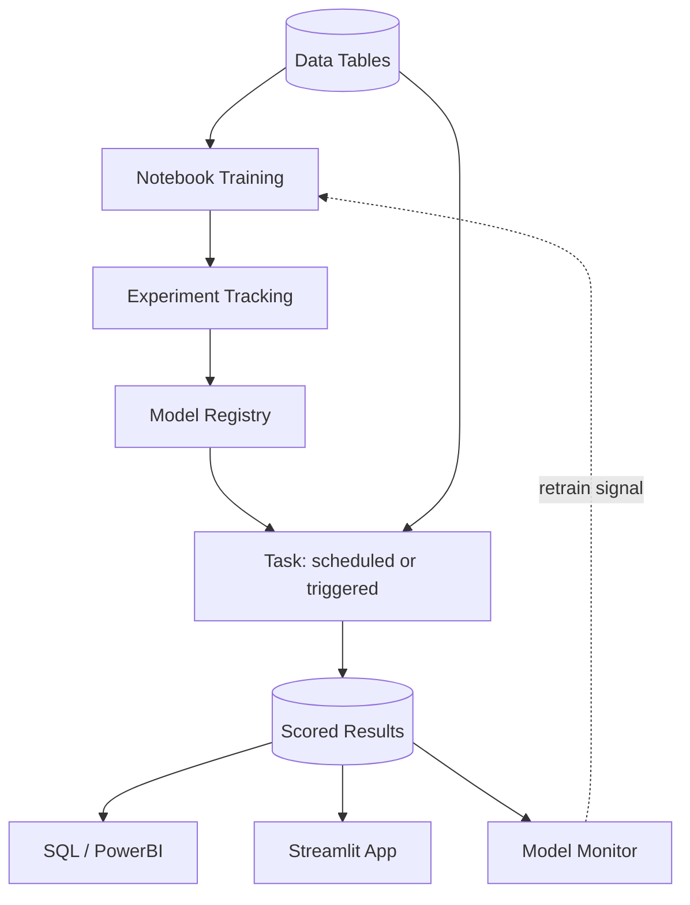

# Machine Learning on Snowflake

The full ML lifecycle — training, versioning, inference, scheduling, monitoring — running inside Snowflake. Same Python, same libraries, without the plumbing between separate tools.

**Audience:** Data scientists and ML engineers moving workloads onto Snowflake

| File | Purpose |
|---|---|
| [`credit_default_model.ipynb`](credit_default_model.ipynb) | Training, evaluation, experiment tracking, registration |
| [`demo_inference_and_tasks.sql`](demo_inference_and_tasks.sql) | SQL inference, approve/decline logic, scheduled scoring |
| [`model_monitoring_setup.sql`](model_monitoring_setup.sql) | Monitor setup and metric queries, verified end to end |
| [`streamlit_app.py`](streamlit_app.py) | Decisioning UI — single applicant and batch |
| [`optional_sample_data.sql`](optional_sample_data.sql) | Synthetic table, to run the notebook before your data lands |

The notebook reads `CREDIT_RISK.ML.LOAN_APPLICATIONS`. Point it at your table and update `feature_cols`, or run `optional_sample_data.sql` first.

> **Reference only — no support provided.** Validate against the linked docs before production use.

---

## Start Here

| If you want to... | Go to |
|---|---|
| Train on Snowflake compute instead of a VM | [1. Notebooks](#1-notebooks) |
| Compare many experiments | [2. Experiment Tracking](#2-experiment-tracking) |
| Version models, stop managing conda envs | [3. Model Registry](#3-model-registry) |
| Ship preprocessing with the model | [4. Preprocessing Pipelines](#4-preprocessing-pipelines) |
| Let analysts and BI tools call the model | [5. SQL Inference](#5-sql-inference) |
| **Schedule an existing multi-step Python script** | [6. Tasks & Python](#6-tasks--python) |
| Handle upstream data that arrives late | [7. Late Data](#7-late-data) |
| Track drift and performance | [8. Monitoring](#8-monitoring) |
| Give stakeholders a UI | [9. Streamlit](#9-streamlit) |
| Connect to your Git repo | [10. GitHub](#10-github) |

---

## Why Snowflake

| On-prem VMs | Snowflake |
|---|---|
| Fixed compute limits tuning | Resize per workload, effective next query |
| Data exports to a Python box | Data and training in one place |
| Pickle files, no versioning | Model Registry with versions and lineage |
| Conda envs and YAML files | Each model version carries its own dependencies |
| Manual monthly scoring | Scheduled or event-triggered Tasks |
| No drift detection | Native monitoring with PSI, AUC, precision, recall |
| Pay for idle VMs | Pay-per-second, idle costs nothing |



---

## 1. Notebooks

Same libraries you use today, running on Snowflake compute.

```python
from snowflake.snowpark.context import get_active_session
from xgboost import XGBClassifier

session = get_active_session()
df = session.table("LOAN_APPLICATIONS").to_pandas()   # no export step

model = XGBClassifier(n_estimators=200, max_depth=5)
model.fit(X_train, y_train)
```

**Sizing:** start on the smallest warehouse that works, size up when a job runs too long or spills to disk. Resizing takes effect on the next query.

```sql
ALTER WAREHOUSE COMPUTE_WH SET WAREHOUSE_SIZE = 'LARGE';   -- for a tuning sweep
ALTER WAREHOUSE COMPUTE_WH SET WAREHOUSE_SIZE = 'X-SMALL'; -- back down after
```

Each size step doubles compute and cost per second, so a job that finishes twice as fast costs about the same. Scaling up is usually cost-neutral. Compute Pools cover GPU work.

---

## 2. Experiment Tracking

Parameters, metrics, and run history without an MLflow server.

```python
from snowflake.ml.experiment import ExperimentTracking

exp = ExperimentTracking(session=session, database_name="CREDIT_RISK", schema_name="ML")
exp.set_experiment("CREDIT_DEFAULT_EXPERIMENT")

with exp.start_run("xgboost_v1"):
    exp.log_params({'max_depth': 5, 'learning_rate': 0.1})
    exp.log_metrics({'auc': 0.76, 'ks_statistic': 0.41})
```

Compare runs side by side in Snowsight. Autologging callbacks exist for XGBoost, LightGBM, and Keras. Gives you a direct path from best run to registry.

---

## 3. Model Registry

```python
from snowflake.ml.registry import Registry

reg = Registry(session=session, database_name="CREDIT_RISK", schema_name="ML")

mv = reg.log_model(
    model,
    model_name="CREDIT_DEFAULT_MODEL",
    version_name="v1",
    sample_input_data=X_test.head(10),
    conda_dependencies=["xgboost", "scikit-learn"],
    target_platforms=["WAREHOUSE"],
)
```

| Capability | What you get |
|---|---|
| Versioning | v1, v2, v3 all callable; roll back by re-pointing an alias |
| Dependency isolation | One model on xgboost 1.7 and another on 2.0 coexist. No env activation |
| Schema | Consumers know what to pass and what comes back |
| Lineage | Which table and columns trained each version |
| Explainability | SHAP enabled automatically with `sample_input_data` + warehouse target |

Pass a **Snowpark** DataFrame as `sample_input_data` to capture lineage. `version_name` must be unique — bump it on re-runs or omit it to auto-generate.

---

## 4. Preprocessing Pipelines

Register cleaning and the model as one object so the transformation that ran at training time is the one that runs at scoring time.

```python
from sklearn.pipeline import Pipeline
from sklearn.preprocessing import StandardScaler
from sklearn.impute import SimpleImputer
from xgboost import XGBClassifier

pipe = Pipeline([
    ('imputer',    SimpleImputer(strategy='mean')),
    ('scaler',     StandardScaler()),
    ('classifier', XGBClassifier(n_estimators=200, max_depth=5)),
])
pipe.fit(X_train, y_train)

reg.log_model(pipe, model_name="CREDIT_DEFAULT_PIPELINE", version_name="v1",
              sample_input_data=X_test.head(10),
              conda_dependencies=["scikit-learn", "xgboost"],
              target_platforms=["WAREHOUSE"])
```

Now raw data goes in and a score comes out:

```sql
SELECT CREDIT_DEFAULT_PIPELINE!PREDICT_PROBA(<raw columns>) FROM NEW_APPLICATIONS;
```

The same object works on a warehouse or an SPCS endpoint — add `"SNOWPARK_CONTAINER_SERVICES"` to `target_platforms`.

**If an sklearn Pipeline doesn't fit** — multiple chained models, an unsupported library, multiple output columns — use `CustomModel`:

```python
from snowflake.ml.model import custom_model
import pandas as pd

mc = custom_model.ModelContext(feature_preproc=my_preprocessor, model=my_xgb_model)

class CreditScoringModel(custom_model.CustomModel):
    @custom_model.inference_api
    def predict(self, input: pd.DataFrame) -> pd.DataFrame:
        features = self.context['feature_preproc'].transform(input)
        return pd.DataFrame({'prob_default': self.context['model'].predict_proba(features)[:, 1]})
```

Two rules: access objects through `self.context[...]` rather than assigning to `self` (direct assignment captures a second copy and bloats the model), and handle multi-row DataFrames since requests get batched. Use `code_paths=[...]` to bring helper modules along.

---

## 5. SQL Inference

```sql
WITH scored AS (
    SELECT APPLICANT_ID,
        CREDIT_RISK.ML.CREDIT_DEFAULT_MODEL!PREDICT_PROBA(
            FICO_SCORE, VANTAGE_SCORE, ...
        ):output_feature_1::FLOAT AS PROB_DEFAULT
    FROM NEW_APPLICATIONS
)
SELECT APPLICANT_ID, ROUND(PROB_DEFAULT, 3) AS PROB_DEFAULT,
       CASE WHEN PROB_DEFAULT > 0.35 THEN 'DECLINE' ELSE 'APPROVE' END AS DECISION
FROM scored;
```

`PREDICT_PROBA` returns probabilities; `PREDICT` returns the hard class label. For risk scoring you want `PREDICT_PROBA` — `output_feature_1` is the positive class.

Callable by anyone with SQL: analysts in Snowsight, PowerBI and Tableau over the connection they already have, scheduled tasks, Streamlit apps.

---

## 6. Tasks & Python

You don't need to rewrite an existing multi-step Python script as SQL. Register it as a stored procedure and call it from a task.

```sql
CREATE OR REPLACE PROCEDURE MONTHLY_SCORING_RUN()
RETURNS STRING LANGUAGE PYTHON RUNTIME_VERSION = '3.11'
PACKAGES = ('snowflake-snowpark-python', 'snowflake-ml-python')
HANDLER = 'main'
AS $$
from snowflake.ml.registry import Registry

def main(session):
    cleaned = session.table("LOAN_APPLICATIONS").filter(...)     # step 1
    features = cleaned.select([...])                             # step 2
    reg = Registry(session=session, database_name="CREDIT_RISK", schema_name="ML")
    mv = reg.get_model("CREDIT_DEFAULT_MODEL").version("V1")
    scored = mv.run(features, function_name="PREDICT_PROBA")     # step 3
    scored.write.mode("overwrite").save_as_table("SCORED_OUTPUT")# step 4
    return "OK"
$$;

CREATE OR REPLACE TASK RUN_MONTHLY_SCORING
    WAREHOUSE = COMPUTE_WH
    SCHEDULE = 'USING CRON 0 6 2 * * America/New_York'
AS CALL MONTHLY_SCORING_RUN();

ALTER TASK RUN_MONTHLY_SCORING RESUME;
```

*Verified: a 5-step procedure including registry access runs successfully inside a task.*

For steps you want tracked and retried independently, use the DAG API:

```python
from snowflake.core.task.dagv1 import DAG, DAGTask, DAGOperation
from snowflake.core.task import StoredProcedureCall
from datetime import timedelta

dag = DAG(name="monthly_credit_scoring", schedule=timedelta(days=30))
with dag:
    t_clean  = DAGTask("clean",  StoredProcedureCall(clean_sp,  stage_location="@ML_STAGE",
                       packages=["snowflake-snowpark-python"]), warehouse="COMPUTE_WH")
    t_score  = DAGTask("score",  StoredProcedureCall(score_sp,  stage_location="@ML_STAGE",
                       packages=["snowflake-snowpark-python", "snowflake-ml-python"]),
                       warehouse="COMPUTE_WH")
    t_clean >> t_score

DAGOperation(schema).deploy(dag, mode="orreplace")
```

**Gotcha:** to pass `args` to `StoredProcedureCall`, `func` must be a registered stored procedure, not a plain function. Register with `session.sproc.register(...)` first.

---

## 7. Late Data

The problem: a monthly table usually updates on the 2nd, sometimes it doesn't. A scheduled task runs anyway and either fails or — worse — succeeds against stale data.

Triggered tasks run when the data arrives instead of on a clock.

```sql
CREATE OR REPLACE STREAM NEW_APPLICATIONS_STREAM ON TABLE NEW_APPLICATIONS;

CREATE OR REPLACE TASK SCORE_ON_ARRIVAL
  WAREHOUSE = COMPUTE_WH
  WHEN SYSTEM$STREAM_HAS_DATA('NEW_APPLICATIONS_STREAM')   -- no SCHEDULE
AS CALL MONTHLY_SCORING_RUN();

ALTER TASK SCORE_ON_ARRIVAL RESUME;
```

*Verified: inserted 50 rows and the task fired on its own. Task history showed SKIPPED (no data) → SUCCEEDED (data arrived) → SKIPPED (stream drained), all with `SCHEDULED_FROM = TRIGGER`.*

- No compute consumed while waiting, and skipped runs cost nothing
- Only one instance runs at a time; new data mid-run queues the next
- Checks every 30s by default, tunable to 10s via `USER_TASK_MINIMUM_TRIGGER_INTERVAL_IN_SECONDS`
- A health check runs if nothing has fired in 12 hours, to prevent stream staleness

Require multiple sources with `AND`, or either with `OR`:

```sql
WHEN SYSTEM$STREAM_HAS_DATA('applications_stream')
 AND SYSTEM$STREAM_HAS_DATA('bureau_data_stream')
```

Converting an existing scheduled task:

```sql
ALTER TASK my_task SUSPEND;
ALTER TASK my_task UNSET SCHEDULE;
ALTER TASK my_task MODIFY WHEN SYSTEM$STREAM_HAS_DATA('my_stream');
ALTER TASK my_task RESUME;
```

Streams work on tables, views, dynamic tables, Iceberg tables, and shares — not hybrid or external tables.

---

## 8. Monitoring

Native drift and performance metrics. No Python, no third-party vendor. Full runnable setup in [`model_monitoring_setup.sql`](model_monitoring_setup.sql).

```sql
USE SCHEMA CREDIT_RISK.ML;   -- MODEL resolves against the current schema

CREATE OR REPLACE MODEL MONITOR CREDIT_DEFAULT_MONITOR WITH
    MODEL = CREDIT_DEFAULT_MODEL
    VERSION = 'V1'
    FUNCTION = 'PREDICT_PROBA'
    SOURCE = CREDIT_RISK.ML.SCORED_APPLICATIONS
    BASELINE = CREDIT_RISK.ML.MONITOR_BASELINE
    WAREHOUSE = COMPUTE_WH
    REFRESH_INTERVAL = '1 day'
    AGGREGATION_WINDOW = '1 day'
    TIMESTAMP_COLUMN = SCORED_AT
    ID_COLUMNS = ( 'APPLICANT_ID' )
    PREDICTION_SCORE_COLUMNS = ( 'PROB_DEFAULT' )
    PREDICTION_CLASS_COLUMNS = ( 'PREDICTED_DEFAULT' )
    ACTUAL_CLASS_COLUMNS = ( 'ACTUAL_DEFAULT' );
```

### Three things that will bite you

All three produced real failures in testing.

**Column parameters take quoted strings.** `( 'PROB_DEFAULT' )`, not `( PROB_DEFAULT )` — they're array constants. But `MODEL`, `SOURCE`, `BASELINE`, `TIMESTAMP_COLUMN`, and `WAREHOUSE` are bare unquoted identifiers. Mixed convention in one statement.

**`MODEL` resolves against the current schema.** Fails with *"MODEL does not exist or not authorized"* if your session points elsewhere, even with a fully qualified monitor name. `USE SCHEMA` first.

**You need both prediction columns.** `ROC_AUC` needs a prediction **score**; `PRECISION`, `RECALL`, `F1_SCORE`, and `CLASSIFICATION_ACCURACY` need a prediction **class**. With only a score column, those four return **NULL with no error raised**. Declare both. This is free in practice — the score is the model output, the class is your approve/decline decision.

### Metrics

| Function | Metrics |
|---|---|
| `MODEL_MONITOR_DRIFT_METRIC` | `POPULATION_STABILITY_INDEX` (PSI; on a feature column this is CSI), `JENSEN_SHANNON`, `WASSERSTEIN`, `DIFFERENCE_OF_MEANS` |
| `MODEL_MONITOR_PERFORMANCE_METRIC` | Binary: `ROC_AUC`, `CLASSIFICATION_ACCURACY`, `PRECISION`, `RECALL`, `F1_SCORE`. Regression: `RMSE`, `MAE`, `MAPE`, `MSE` |
| `MODEL_MONITOR_STAT_METRIC` | `COUNT`, `COUNT_NULL`, `MIN`, `MAX`, `AVG`, `SUM` |

Drift works on any feature, the prediction, or the actual. Feature columns are discovered automatically from the source table.

```sql
SELECT EVENT_TIMESTAMP::DATE AS DAY, ROUND(METRIC_VALUE, 4) AS ROC_AUC, COUNT_USED
FROM TABLE(MODEL_MONITOR_PERFORMANCE_METRIC(
  'CREDIT_DEFAULT_MONITOR', 'ROC_AUC', '1 DAY',
  DATEADD('DAY', -30, CURRENT_DATE()), CURRENT_DATE()))
ORDER BY DAY DESC;
```

Metrics return as table functions, so you can point Streamlit or any BI tool at them and set threshold alerts. Dashboards live in Snowsight under **AI & ML » Models » Monitors**.

Segment by product, channel, or risk tier with `SEGMENT_COLUMNS = ( 'PRODUCT_TYPE' )` — string columns only, bucket numerics first.

### Constraints worth knowing up front

- **Baseline is set at creation.** Adding one later requires dropping and recreating the monitor.
- Monitor must live in the same schema as the model version. One monitor per version.
- `TIMESTAMP_NTZ` for timestamps; `NUMBER` for prediction and actual columns.
- No nulls, NaN, Inf, or scores outside 0–1 in the source — these suspend the monitor.
- Limits: 500 features, 250 monitors per account, 5 segment columns.
- Auto-suspends after 5 consecutive refresh failures. Check `DESCRIBE MODEL MONITOR` for `aggregation_last_error`, then `RESUME`.

PSI compares each window against the baseline snapshot, so a small daily window against a large baseline shows some drift from sample size alone. Calibrate thresholds from a period you consider normal, not from textbook cutoffs.

**On an 18-month label lag:** drift gives you immediate early warning ("are we approving more than usual?"), and performance metrics recalculate as actuals land.

---

## 9. Streamlit

Web apps hosted in Snowflake, no infrastructure. Deploy from a Workspace and it becomes a standalone Streamlit object — end users see the interface, not the code. See [`streamlit_app.py`](streamlit_app.py).

---

## 10. GitHub

Commit and push from Workspaces, Notebooks, and Streamlit apps. Supports GitHub, GitLab, Bitbucket, Azure DevOps, AWS CodeCommit.

The GitHub App is the simplest path — no OAuth registration or redirect URI:

```sql
CREATE OR REPLACE API INTEGRATION my_git_api_integration
  API_PROVIDER = git_https_api
  API_ALLOWED_PREFIXES = ('https://github.com')
  API_USER_AUTHENTICATION = (TYPE = SNOWFLAKE_GITHUB_APP)
  ENABLED = TRUE;
```

Then create a Git workspace in Snowsight and authorize in the browser. Works with github.com including GitHub Enterprise Cloud; `*.ghe.com` and Enterprise Server need the OAuth2 path instead.

For a personal access token instead, create a `TYPE = password` secret, reference it via `ALLOWED_AUTHENTICATION_SECRETS`, then `CREATE GIT REPOSITORY ... GIT_CREDENTIALS = <secret>`. Repos behind a firewall can use private link (Business Critical).

Once connected: fetch branches and commits, browse and search files, reference repo files as procedure handlers, `EXECUTE IMMEDIATE` from `.sql` files, import repo modules.

---

## 11. Version Control

**Git for code** (section 10). **Registry for models** — versions, per-version metrics, dependency isolation, lineage, and aliases you can re-point to roll back. A model version's lineage tells you what data produced it; Git tells you what code did.

---

## 12. Loading Data

```sql
CREATE STAGE IF NOT EXISTS ML_STAGE
  FILE_FORMAT = (TYPE = CSV FIELD_OPTIONALLY_ENCLOSED_BY = '"' SKIP_HEADER = 1);
```

```bash
snow stage copy ./large_extract.csv @CREDIT_RISK.ML.ML_STAGE
```

```sql
COPY INTO BUREAU_EXTRACT FROM @ML_STAGE/large_extract.csv ON_ERROR = 'CONTINUE';
SELECT * FROM TABLE(VALIDATE(BUREAU_EXTRACT, JOB_ID => '_last'));   -- rejected rows
```

Useful for messy extracts: `ON_ERROR = 'CONTINUE'` loads good rows and skips bad, `MATCH_BY_COLUMN_NAME = 'CASE_INSENSITIVE'` maps by header instead of position, `PURGE = TRUE` cleans up after a successful load.

Snowsight has a browser Load Data wizard for smaller files. For recurring loads, Snowpipe auto-ingests as files land in cloud storage.

> File size limits shift — confirm current numbers against the docs at implementation time.

---

## Marketplace

Snowflake Marketplace hosts third-party data products — credit bureau attributes, commercial and consumer data, alternative data. Worth checking whether something relevant to your models exists. When it does, it appears as a live table with no file transfers.

---

## Build Order

1. Train in a notebook, with experiment tracking
2. Register the model, preprocessing packaged in
3. Call it from SQL
4. Automate scoring — scheduled, or triggered on data arrival
5. Add a monitor, baseline set at creation

Three decisions that are awkward to reverse:

| Decision | Why |
|---|---|
| Set the monitor **baseline** at creation | Adding one later means recreating the monitor |
| Declare **both** prediction score and class columns | Four performance metrics silently return NULL otherwise |
| Package preprocessing **with** the model | Otherwise scoring-time cleaning can drift from training-time |

---

## References

- [Snowflake ML](https://docs.snowflake.com/en/developer-guide/snowflake-ml/overview) · [Model Registry](https://docs.snowflake.com/en/developer-guide/snowflake-ml/model-registry/overview) · [Pre/post-processing](https://docs.snowflake.com/en/developer-guide/snowflake-ml/model-registry/custom-processing-with-models)
- [ML Observability](https://docs.snowflake.com/en/developer-guide/snowflake-ml/model-registry/model-observability) · [Monitor functions](https://docs.snowflake.com/en/sql-reference/functions-model-monitors) · [CREATE MODEL MONITOR](https://docs.snowflake.com/en/sql-reference/sql/create-model-monitor)
- [Notebooks](https://docs.snowflake.com/en/user-guide/ui-snowsight/notebooks) · [Python stored procedures](https://docs.snowflake.com/en/developer-guide/stored-procedure/python/procedure-python-overview) · [Task graphs](https://docs.snowflake.com/en/developer-guide/snowflake-python-api/snowflake-python-managing-tasks)
- [Triggered tasks](https://docs.snowflake.com/en/user-guide/tasks-triggered) · [Git integration](https://docs.snowflake.com/en/developer-guide/git/git-overview) · [Marketplace](https://app.snowflake.com/marketplace)
